<div align="center">

[](https://github.com/leccorside)

</div>

<div align="center">
  <h1 align="center">
    Desafio Front-End React
  </h1>
</div>

<div align="center">


</div>

## 1° Precisamos preparar o ambiente de desenvolvimento
Programas necessários:

**Visual Studio Code**: **[download](https://code.visualstudio.com/download)** para edição dos scripts
**Mysql**: **[download](https://www.apachefriends.org/pt_br/download.html)** para criação, edição e utilização do banco de dados no projeto

**Node**: **[download](https://nodejs.org/en/download/current)** para interpretação de scripts e gerenciamento de pacotes

**Git**: **[download](https://git-scm.com/download/win)** para gerenciamento e manipulação de código e repositório


## 2° Após instalar os programas necessários, Vamos clonar os repositórios do Backend e Frontend

```bash
git clone https://github.com/leccorside/desafio-frontend-react.git
```

## 3° Vamos instalar as dependencias na pasta backend
Dentro da pasta execute o comando:

```bash
npm install
```

## 4° Vamos iniciar o Xampp para criar o banco de dados
Abra o Xampp instalado anteriormente, e clique em **START** nas opções de **APACHE** e **MYSQL**

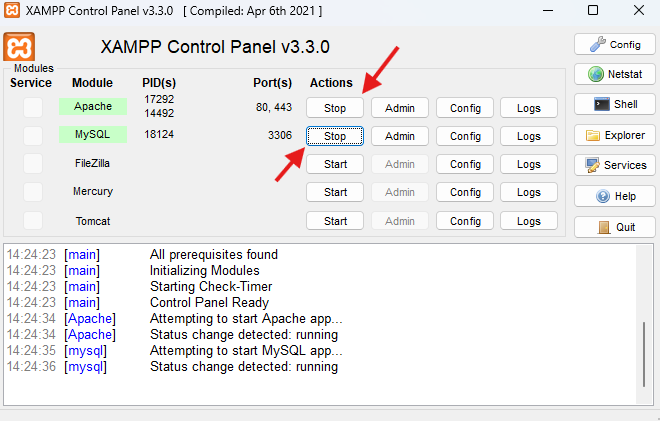


## 5° Vamos abrir o phpmyadmin
Após iniciar os serviços e clique em **ADMIN** nas opções **MYSQL**

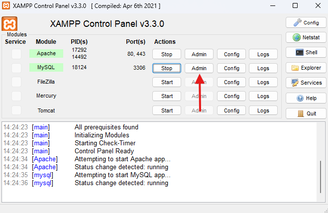


## 6° Vamos criar um banco de dados no phpmyadmin
Clique em **NOVO** para abrir as opções de criação do banco de dados

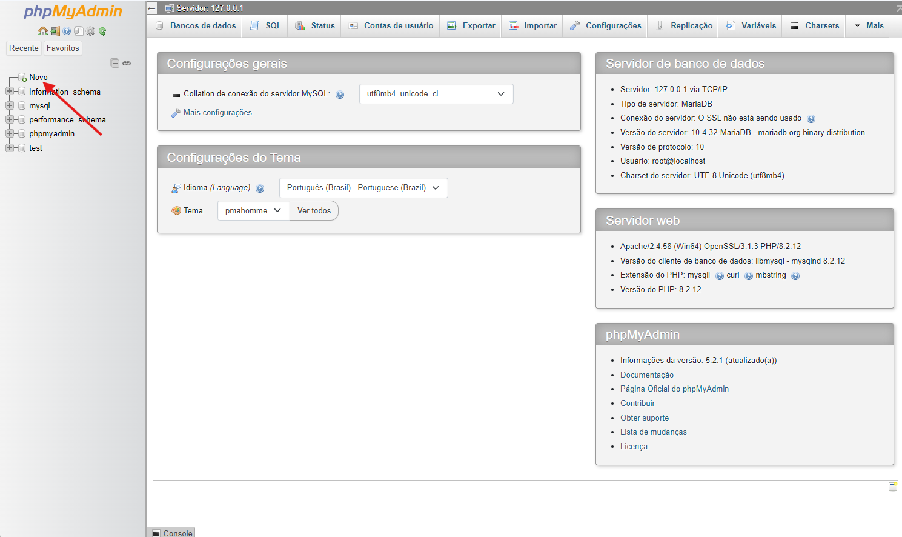


## 7° Vamos criar um banco de dados no phpmyadmin
Clique em **NOVO** para abrir as opções de criação do banco de dados


Crie um banco de dados com o nome **auth_db** e clique em criar

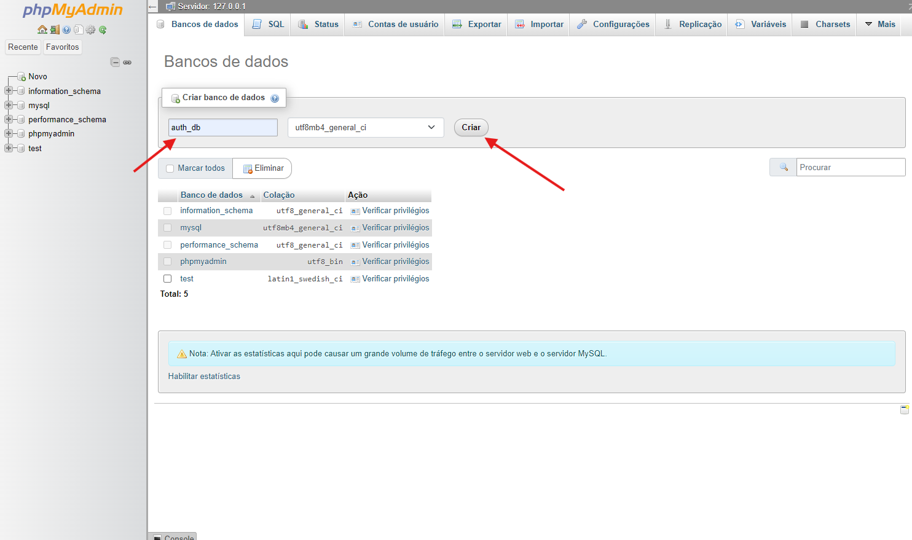


## 8° Vamos importar o banco de dados
Dentro do banco criado clique em **IMPORTAR**

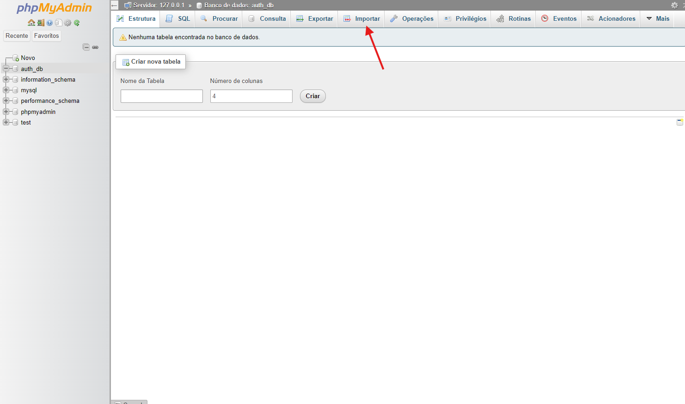


Escolha o arquivo **auth_db.sql** contido dentro da pasta raiz do projeto

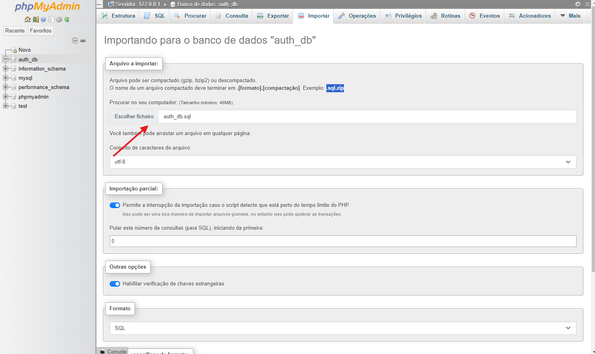


Depois de escolher o arquivo clique em **IMPORTAR**

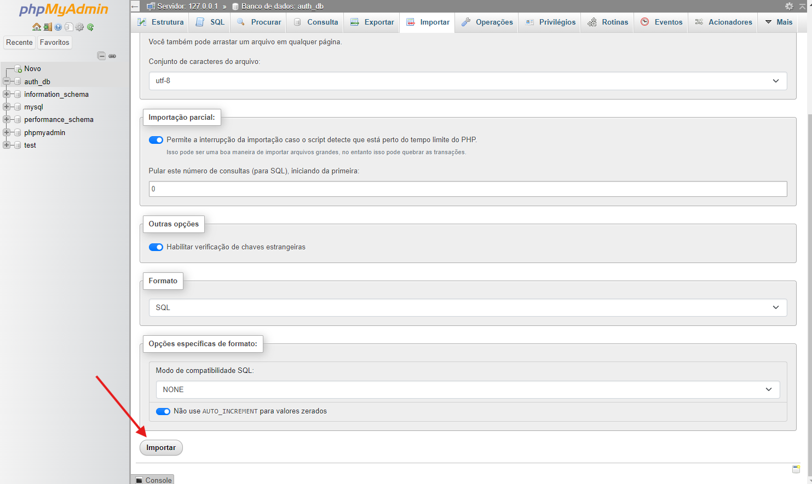


As tabelas **product**, **sessions** e **users** devem ser criadas após importar o banco

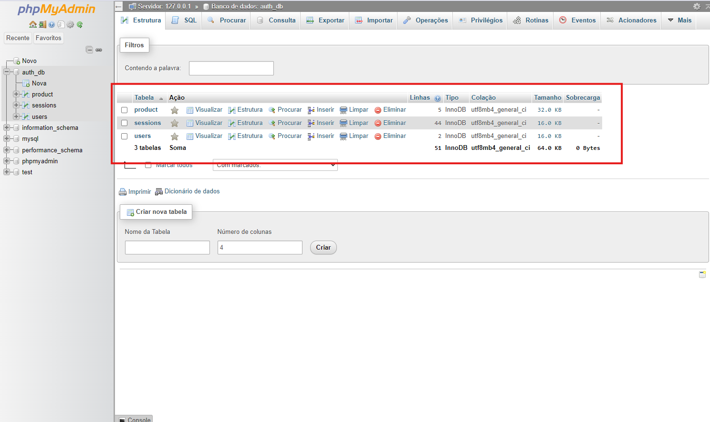


## 9° Vamos configurar os dados de acesso ao banco de dados
Dentro da raiz do backend existe uma pasta **config**, abra o arquivo **Database.js** e insira os dados de acesso, que por padrão deve ser deixado como na imagem abaixo.

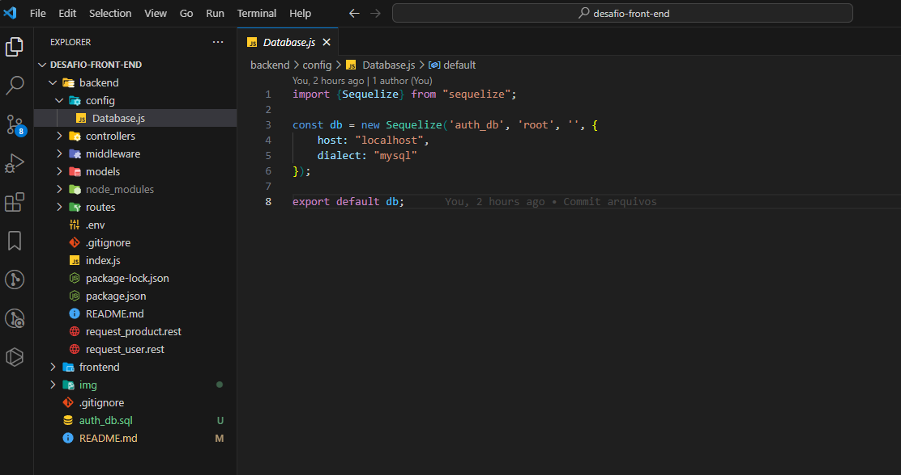


## 10° Criando arquivo ENV caso não exista
Caso o arquivo não esteja na pasta do backend precisamos criar um arquivo chamado **.env** na raiz do backend

```bash
APP_PORT = 5000
SESS_SECRET = asd65asd6as5d65asd677asdasd76asd56a7sd56asd56asd5
```


## 11° Verificando se o servidor Node está rodando corretamente 
Abra o arquivo **index.js** na raiz do backend e execute o comando no terminal:

```bash
nodemon index
```

No terminal deverá aparecer a mensagem **Servidor instalado e funcionando...**, isso significa que está tudo ok no backend

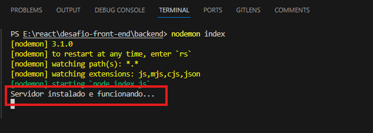


## 12° Agora vamos instalar as dependencias na pasta do frontend 
Execute o esté comando na pasta raiz do frontend:

```bash
npm install
```

## 14° Após instalar as dependencias, vamos testar o frontend
Execute o comando para abrir o projeto no navegador:

```bash
npm start
```

Caso o navegador não abra automaticamente, basta abrir o link conforme mostrado na imagem

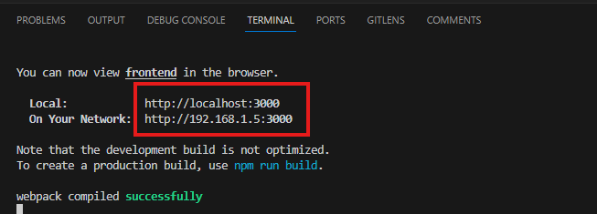


## DADOS DE ACESSO
ADMIN
**EMAIL**: recrutamento@grupotxai.com.br

**SENHA**: 123456789

USER
**EMAIL**: teste@gmail.com

**SENHA**: 123456789
